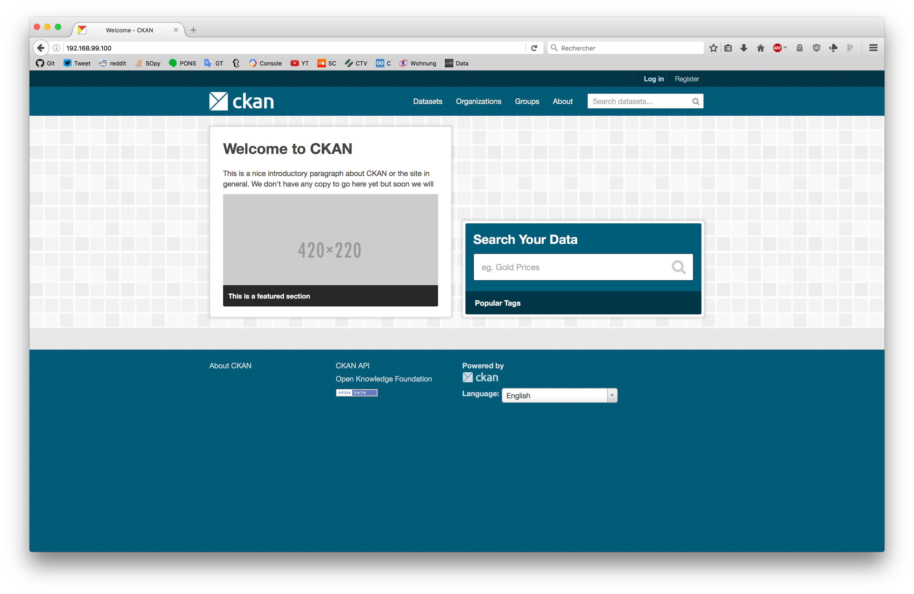
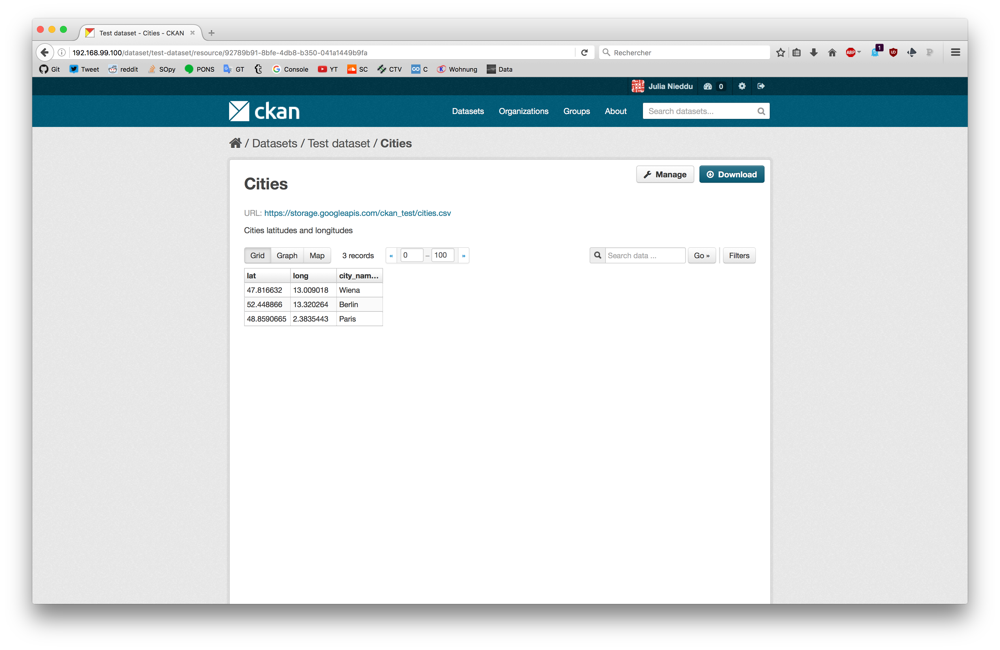
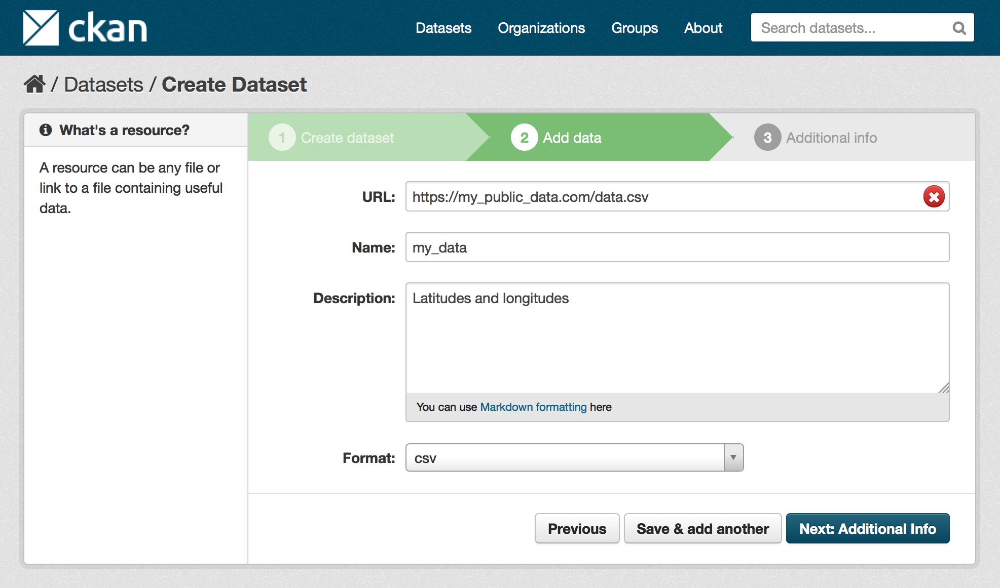

## CKAN Enabler
CKAN is an Open Data Management Platform to create and share datasets and resources. Furthermore, CKAN permits a two-sides usage:
- Administrators who create groups and datasets
- Users who access and preview datasets.

## 0. Requirements
For all the following steps, you will need to have the <a href='https://docs.docker.com/'>Docker Quickstart Terminal</a> installed.

## 1. Check Out the FIWARE Repository

```bash
[~]$ git clone https://github.com/IAIS4EP/fiware.git
```

and go to the folder `fiware/ge/ge_ckan`.

## 2. Run the required containers for CKAN
CKAN needs two main components in order to work correctly:
- **Postgresql** : the database to store data
- **Solr** : the text-search engine to query data

Before continuing, let's set all the components names we will further need:

```bash
[ge_ckan]$ export POSTGRESQL_CONTAINER=postgresql
[ge_ckan]$ export SOLR_CONTAINER=solr
[ge_ckan]$ export CKAN_IMAGE=ckan_image
[ge_ckan]$ export CKAN_CONTAINER=ckan
```

Now we can create and run the two containers CKAN will work with :

```bash
[ge_ckan]$ docker run -d --name ${POSTGRESQL_CONTAINER} ckan/postgresql
[ge_ckan]$ docker run -d --name ${SOLR_CONTAINER} ckan/solr
```

## 3. Build the CKAN image

```bash
[ge_ckan]$ docker build -t ${CKAN_IMAGE} .
```

## 4. Create your CKAN instance

Your CKAN image built, you can now link it to his dependencies and run it :

```bash
[ge_ckan]$ docker run -d -p 80:80 --link ${POSTGRESQL_CONTAINER}:db --link ${SOLR_CONTAINER}:solr --name ${CKAN_CONTAINER} ${CKAN_IMAGE}
```

The two arguments after the `--link` parameter are giving an alias name to the two linked containers. The two alias name are the same as those used in the CKAN configuration.

### 5. Access your CKAN instance

Your instance is now running. To access it you need to find your IP address.

#### You are running a Virtual Machine (on Mac OS for example)?

You can then determine your IP address with this command

```bash
[ge_ckan]$ docker-machine ls

NAME      ACTIVE   DRIVER       STATE     URL                         SWARM
default   *        virtualbox   Running   tcp://THIS_IS_YOUR_IP:2376
```

#### Your computer runs already on Linux?

```bash
[ge_ckan]$ docker inspect --format '{{ .NetworkSettings.IPAddress }}' ${CKAN_CONTAINER}
THIS_IS_YOUR_IP
```

You can now access your CKAN instance using your Web browser at the address: `THIS_IS_YOUR_IP`

<div style="text-align:center; background-color:lightgrey; color:#666666; margin:2px;">

<p style="font-size:12px; text-align:left; margin-left: 20px; margin-top: 3px;">CKAN homepage</p>
</div>

### 6. Notes and advices - use of CKAN

One of the powerful possibilities of CKAN is to preview your coordinates data.
<div style="text-align:center; background-color:lightgrey; color:#666666; margin:2px; float:left;">


<p style="font-size:12px; text-align:left; margin-left: 20px; margin-top: 3px; float:left; width:290px;">Data preview : table</p>
<p style="font-size:12px; text-align:left; margin-left: 20px; margin-top: 3px;">Data preview : map</p>
</div>

In order to access this preview, you need to fulfill two conditions :
- **Public dataset** : your data must be public ones, and you should provide the url pointing to them to CKAN when creating your dataset.
- **Data type** : CKAN needs to understand your data to preview them. For this reason, you need to help him and tell him what is the format of the data you are using in your dataset.

Those two conditions are shawn in the image here under:
<div style="text-align:center; background-color:lightgrey; color:#666666; margin:2px;">

<p style="font-size:12px; text-align:left; margin-left: 20px; margin-top: 3px;">Coordinates data preview</p>
</div>
